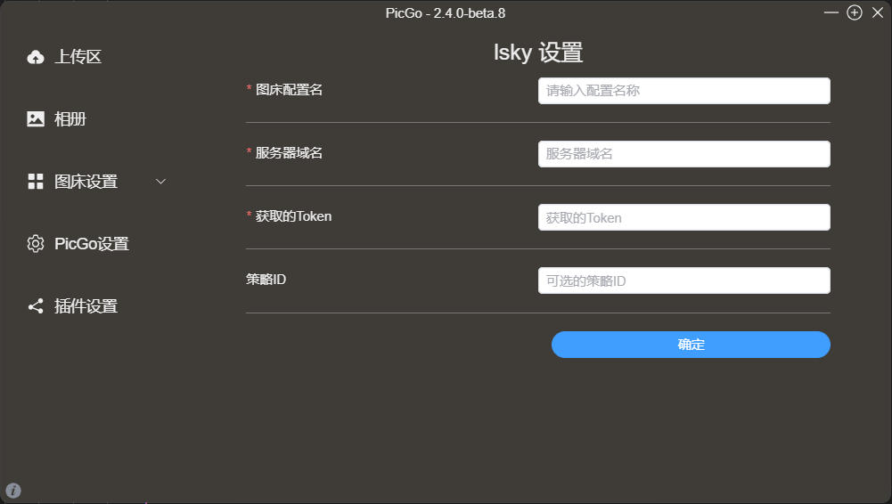

## picgo-plugin-lsky-uploader

为基于 [PicGo-Core](https://github.com/PicGo/PicGo-Core) 开发的项目提供的 uploader，用于上传至服务器自建的 [lsky-pro](https://github.com/lsky-org/lsky-pro)，即开源版的兰空图床，兼容最新版api，底层请求已按照文档适配新版 picgo，目前已在最新版 [PicList](https://github.com/Kuingsmile/PicList) （第三方基于 [PicGo-Core](https://github.com/PicGo/PicGo-Core) 开发的项目）上进行测试，测试结果返回成功

## 安装

- npm

  npm install picgo-plugin-lsky-uploader

- PicList

  - 在线安装

    插件设置当中搜索 lsky-uploader

  - 离线安装

    克隆本仓库，复制项目到 PicList 配置目录，执行 `npm install ./picgo-plugin-lsky-uploader`，然后重启应用即可

## 参数

|  参数名称   |                             描述                             |            示例             | 是否必须 |
| :---------: | :----------------------------------------------------------: | :-------------------------: | :------: |
| 服务器域名  |              服务器域名，不需要填补具体上传接口              | https://image.lsilencej.top |    是    |
| 获取的Token | 通过自行调用获取 token 的 api 获取的 token，不需要添加 Bearer |      1\|11111111111111      |    是    |
|   策略ID    |                    图床的存储策略ID，可选                    |              1              |    否    |

## 截图

